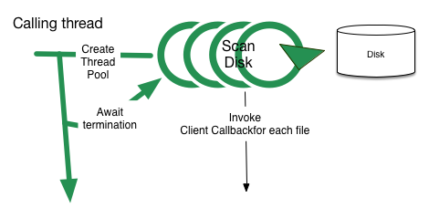
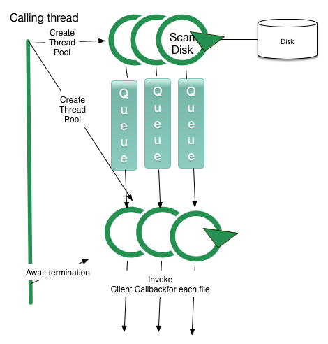
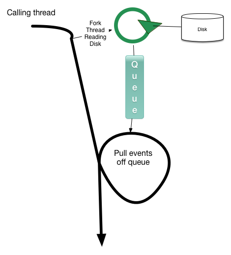
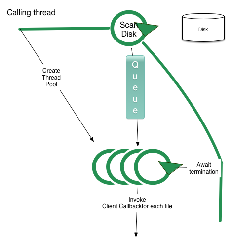

Fast-Dirscan
===========

Based on the apache ant directory scanner as well as the codehaus plexus-utils fork (used
by maven), this code aims to experiment with various concurrent implementations that all intend
to achieve a high degree of mechanical sympathy.

Achieving mechanical sympathy in this area is believed to consist of the following optimizations:

1. Keeping IO subsystem optimally busy; avoiding delays caused by processing
   operations interleaved with IO
2. Avoiding repeated IO at all costs, create an API that will facilitate this in layered architectures.
3. Optimizing IO operations to use most efficient available constructs.
4. Exposing an inherently concurrent api to the client that will allow further
   file processing to to occur concurrently.
5. Exposing a non-concurrent api to conservative clients that need minimal changes (possibly layered on
   top of the concurrent API)
6. Be garbage-collector friendly. Must not be confused with allocating *no* objects,
   but must clients of current API's do repeated allocations of the same objects.
7. Be memory model friendly, use optimal handover algorithms to ensure minimum latency.

Goal
-------

The project aims to create a replacement directory scanner project that can be used by
maven, ant and any other projects using this (or derivate works). The original feature
set is believed to be defined by the ant code, which has been forked a number of times
to handle slight variations.

The project has an apache 2.0 license, and it is my goal to have this project hosted somewhere
at apache eventually if it turns out to be a viable project.

I have no goal of retaining the *full* feature set and extension points of the original ant scanner
or the maven forks, but rather to base the final feature set on what appears to be the common use cases
of this code.

How to use
==========

Single threaded client
-----------------------

Everything the client sees stays on the client thread. As far as the user of this library is concerned,
memory model behaviour is that of a single-threaded application. The iterator returned by SmartScanner is blocking
and will return the first files immediately as they become available.

    SmartScanner ss = new SmartScanner(basedir, null, null, nThreads);

    for (SmartFile s : ss) {
    		// do something
    }

Multithreaded client
--------------------
The scan method will invoked the callbak in a multithreaded manner. Your code in the accept method
has to be thread-safe

    SmartScanner scanner = new SmartScanner(basedir, null, null, nThreads);

    ss.scan(new SmartFileReceiver() { // scan blocks until everything is complete. This might change :)
        @Override
        public void accept(SmartFile file) {
            // Do something
        }
    });

Strategies
-------

The project has investigated different scanning strategies, only a few of which have turned out
to be viable. There are a few other strategies that may still be explored.

The project aims to investigate different strategies, with slightly different implications for client code. The main lines of investigations are as follows:

### Multiple reader threads

Pros:

1. Pushes IO subsystem way further than the single-thread readers.

Cons:

1. May be difficult to determine optimal number of reader threads due to underlying device
  characteristics; creating a general purpose solution may prove hard.
2. It might be necessary to create an alogorithm that needs to be tuned for each individual
   system to achieve optimal performance.

### Multiple Readers With Single Worker Each (Not implemented)

Each reader thread has a dedicated queue to a single worker thread.

Pros:

1. Simple handoff strategy with single writer queue.

Cons:

1. Handoff may prove to add little value and only create hot air.
2. Same as for all multiple reader thread strategies.

Variations:

1. Multiple worker threads per single reader thread. (Not Implemented)

### 2 Thread pools: Multiple Readers, multiple workers. (Not implemented)

This last permutation is a combination of the above models; more than on thread reads the disk, and hands
of to a different worker pool. This probably has little impact in terms of scanning performance,
but might be beneficial when more threads are required for post processing than for scanning.

Non-optimal strategies
=====================
These strategies have been tried but are simply not efficient enogh.

### Forked single reader thread

Pros:

1. Can provide client api's that match current api's fairly well.
2. Zero memory model implications for calling application, everything significant happens
   on client thread.

Cons:

1. Overall limits how the client code can be further optimized for threading, we're not just looking
   at a faster way to scan files; but also how to push concurrency into the further processing.
2. Initial latency for creating reader thread.
3. Single reader IO thread may be too limited, does not push IO subsystem to full potential.

Variations:

1. Use multiple reader threads (see below for further discussion).

Why not:

A single reader thread simply cannot push the required amount of IO to a modern SSD
when it comes to directory scanning. A single reader with efficient distruptor-like handover
to a second thread really only pushes 50% better than current single-thread algorith.

### SingleReaderMultipleConsumers

1. Provides an inherently concurrent API to the client, probably facilitating further
   parallel processing in the client.

Cons:

1. Client must be concurrency-aware.

Why not: See single reader above.
